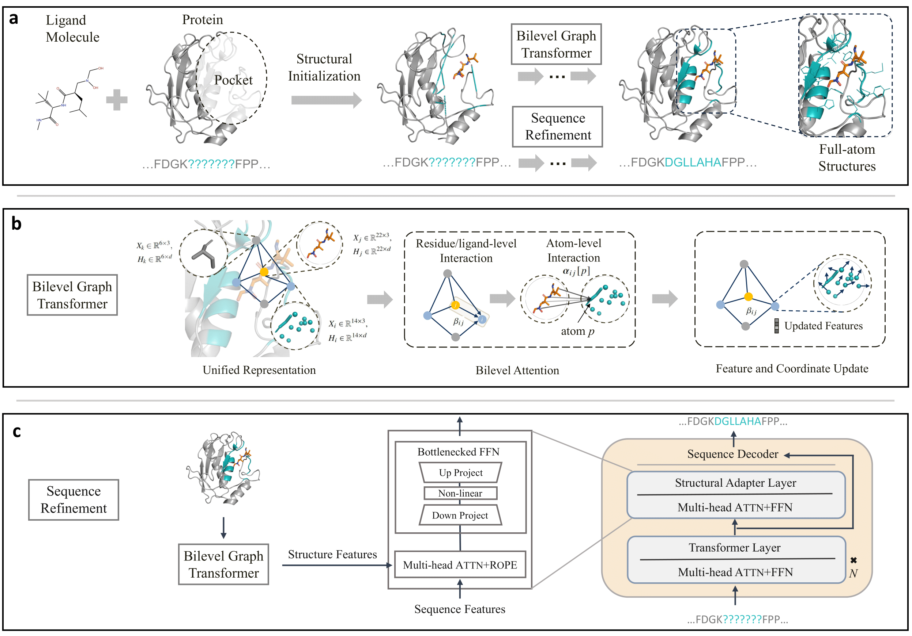
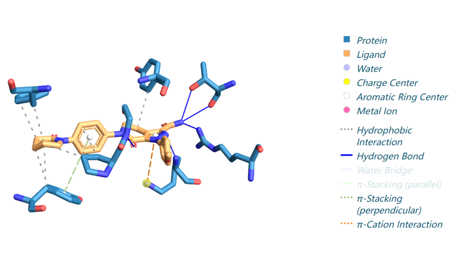

# :loudspeaker: PocketGen: Generating Full-Atom Ligand-Binding Protein Pockets

<div align=center>

</div>

## Environment

### Install conda environment via conda yaml file
```bash
conda env create -f pocketgen.yaml
conda activate pocketgen
```

### Install via Conda and Pip
```bash
conda create -n targetdiff python=3.8
conda activate targetdiff
conda install pytorch pytorch-cuda=11.6 -c pytorch -c nvidia
conda install pyg -c pyg
conda install rdkit openbabel tensorboard pyyaml easydict python-lmdb -c conda-forge
conda install -c conda-forge openmm pdbfixer flask
pip install meeko==0.1.dev3 wandb scipy pdb2pqr vina==1.2.2 
python -m pip install git+https://github.com/Valdes-Tresanco-MS/AutoDockTools_py3
```

## Benchmark Datasets
We use CrossDocked and Binding MOAD datasets to benchmark pocket generation.

### CrossDocked
We download and process the CrossDocked dataset as described by the authors of [TargetDiff](https://github.com/guanjq/targetdiff)  
Firstly download the [crossdocked_v1.1_rmsd1.0.tar.gz](https://drive.google.com/file/d/1U0ZgITApL7EClcQiiVK_OevAV_H20L4d/view?usp=sharing) and [split_by_name.pt](https://drive.google.com/file/d/1UVJmLvx-kcorMyDDR_LPCqR8dFPuoRtI/view?usp=sharing) and put it under the ./data directory.  
Use the following commands to extract pockets, create index_seq.pkl, and split the dataset.
```
python data_preparation/extract_pockets.py
python data_preparation/split_pl_dataset.py
```

### Binding MOAD
We download and process the Binding MOAD dataset following the authors of [DiffSBDD](https://github.com/arneschneuing/DiffSBDD)
Download the dataset
```bash
wget http://www.bindingmoad.org/files/biou/every_part_a.zip
wget http://www.bindingmoad.org/files/biou/every_part_b.zip
wget http://www.bindingmoad.org/files/csv/every.csv

unzip every_part_a.zip
unzip every_part_b.zip
```
Process the raw data using
``` bash
python -W ignore process_bindingmoad.py <bindingmoad_dir>
```
Use the following commands to extract pockets, create index_seq.pkl, and split the dataset.
```
python data_preparation/extract_pockets_moad.py
python data_preparation/split_pl_dataset_moad.py
```

### Processed datasets
We also provide the processed datasets for training from scratch at [zenodo](https://zenodo.org/records/10125312)

For each dataset, it requires the preprocessed .lmdb file and split file _split.pt

### Benchmark Results

Expected result of PocketGen on benchmark datasets:

| CrossDocked | | | Binding MOAD | | |
| --- | --- | --- | --- | --- | --- |
| AAR(↑) | RMSD(↓) | Vina(↓) | AAR(↑) | RMSD(↓) | Vina(↓) |
| 63.40±1.64% | 1.36±0.05 | -7.135±0.08 | 64.43±2.35% | 1.32±0.05 | -8.112±0.14 |


## Training
Train on CrossDocked:
```
python train_recycle.py --config ./config/train_model.yml
```
Train on Binding MOAD:
```
python train_recycle.py --config ./config/train_model_moad.yml
```

## Generation
Pretrained checkpoint: [checkpoint.pt](https://drive.google.com/file/d/1cuvdiu3bXyni71A2hoeZSWT1NOsNfeD_/view?usp=sharing)
```
python generate_new.py
```
We provide one example of the generated pocket for pdbid-2p16 and visualize the interactions with [plip](https://github.com/pharmai/plip)
<div align=center>

</div>

## Acknowledgement
This project draws in part from [TargetDiff](https://github.com/guanjq/targetdiff) and [ByProt](https://github.com/BytedProtein/ByProt), supported by MIT License and Apache-2.0 License. Thanks for their great work and code!

## Contact

Zaixi Zhnag (zaixi@mail.ustc.edu.cn)

Sincerely appreciate your suggestions on our work!

## License

This project is licensed under the terms of the MIT license. See [LICENSE](https://github.com/zaixizhang/Pocket-Generation/blob/main/LICENSE) for additional details.


